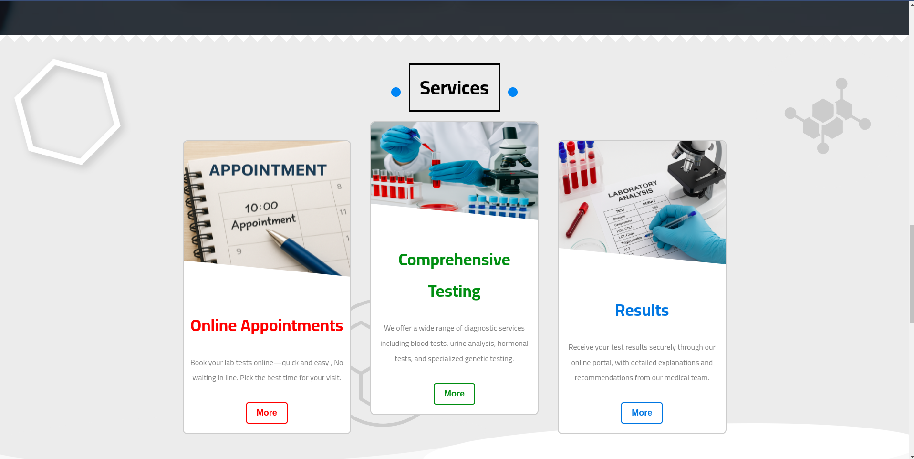
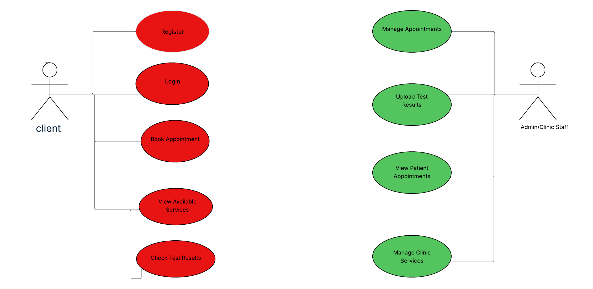

# Noor Laboratory Platform

## Overview
This is a web-based laboratory platform built using Django for the backend and HTML, CSS, and JavaScript for the frontend. It allows users to easily book appointments online, view clinic services, and check their test results remotely. The platform makes it more convenient for patients to manage their healthcare, saves time, and helps clinics run more smoothly.

## Features

- **Online Appointment Scheduling**: Users can book appointments with the clinic for various medical services.
- **Display Clinic Services**: The platform allows users to browse available services provided by the clinic, such as laboratory tests and their prices.
- **Test Results Access**: Users can view their laboratory test results directly through the platform by providing a code they give to them in the clinic
- **User Authentication:**:  Users can sign up and log in  with secure authentication


## Video

**Click in this image bellow to watch the demo video**


[](https://www.youtube.com/watch?v=9x5-wyc-aOA)


## Technology Stack

- **Backend**: Django (Python)
  - Developed the application using the Django framework.
  - Implemented user authentication and authorization.
  - Managed the database using SQLite3/PostgreSQL.
  - Used **Gunicorn** for development to serve the Django application.

- **Database**: PostgreSQL/SQLite3
- **Version Control**: Git & GitHub
- **Deployment**: Automated development workflows with **GitHub Actions**.
- **Hosting**: Hosted the app and database on **Render**.
- **Static Files**: Managed static files (CSS, JS, images) using Django’s built-in static file handling and deployed them on Render’s platform.


## Installation

### Steps to Setup the Backend

1. Clone the repository:

   ```bash
   git clone git@github.com:sirmoncef/Labo.git
   
   cd Labo
   ```


2. Install the backend dependencies:

   ```bash
   pip install -r requirements.txt
   ```


   Update the `DATABASES` section in the `settings.py` file with your PostgreSQL credentials if you use postgresql databse.

5. Run migrations to set up the database schema:

  ```bash
   python manage.py makemigrations
   python manage.py migrate
   ```

6. Create a superuser for admin access:

   ```bash
   python manage.py createsuperuser
   ```

7. Start the backend server:

   ```bash
   python manage.py runserver
   ```

   The server will be running at `http://127.0.0.1:8000`.


##  Diagram

Here is simple use case diagram for the laboratory platform:




